### instalando extensão para exportar markdown para pdf

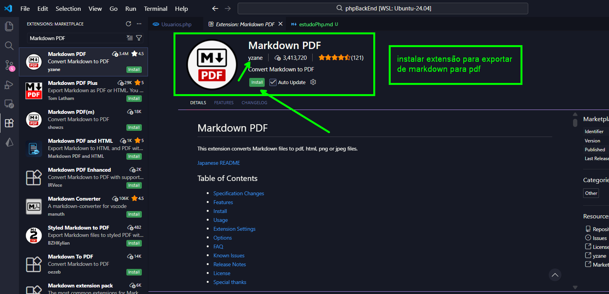

### extensão para visualizar pdf

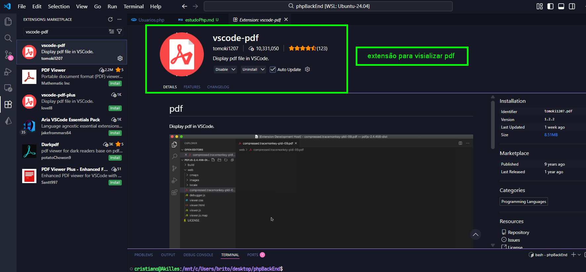

### Opção 3: Print to PDF (nativo Windows)

- Ctrl+Shift+V (preview)
- Ctrl+P (imprimir)
- Escolhe "Salvar como PDF"

## resolvendo o erro do markdown

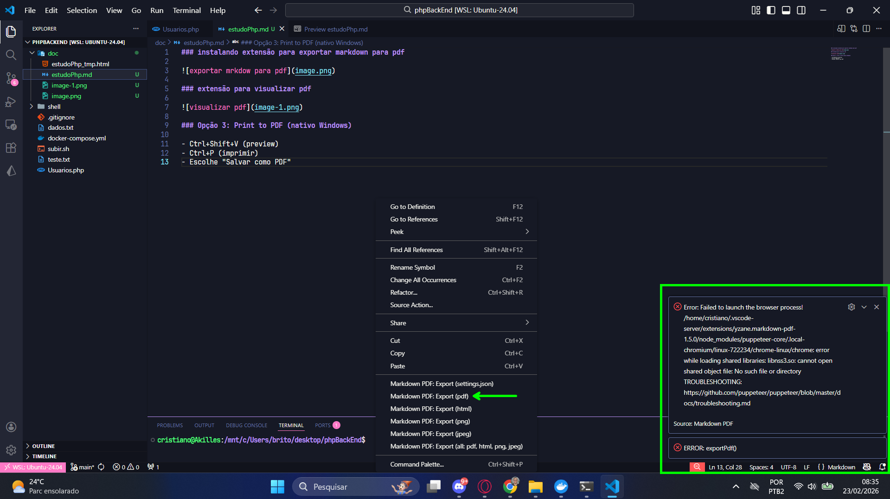

- instalando as bibliotecas para resolver o erro
- sudo apt update && sudo apt install -y libnss3 libatk-bridge2.0-0 libdrm2 libxkbcommon0 libgbm1 libasound2

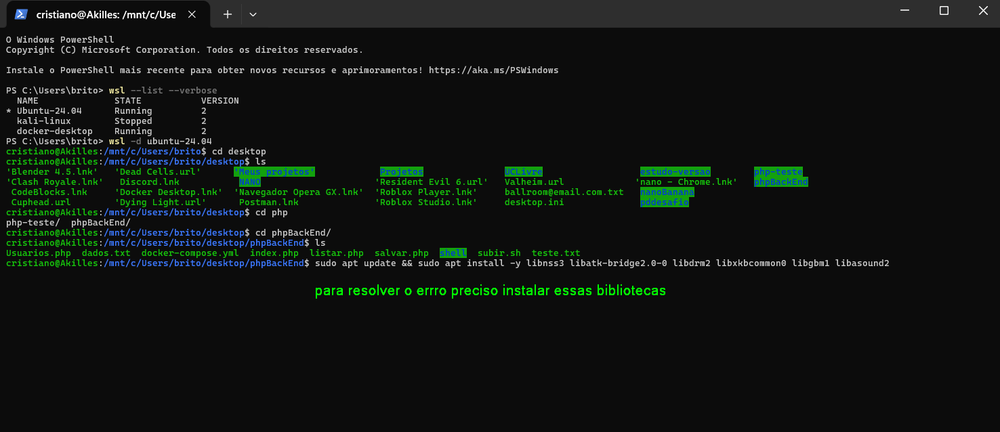

#### Explicação do comando:
- sudo apt update     → Atualiza lista de pacotes
- sudo apt install -y → Instala sem perguntar
- libnss3             → Biblioteca de segurança (a que faltou)
- libatk-bridge2.0-0  → Acessibilidade
- libdrm2             → Renderização gráfica
- libxkbcommon0       → Teclado
- libgbm1             → Gerenciamento de buffer
- libasound2          → Áudio (o Chromium precisa mesmo sem som)

#### a senha do terminal: cristiano

## instalando as libs

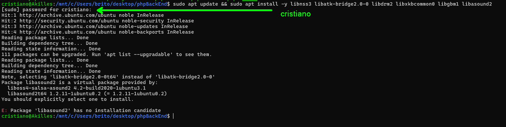
- note o que a saida diz: 'que libasound2 não foi instalada' precisamos corrigir isso e instalar
##### essa instalação deu erro 

# instalação corrigida

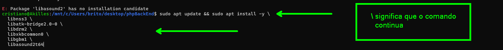

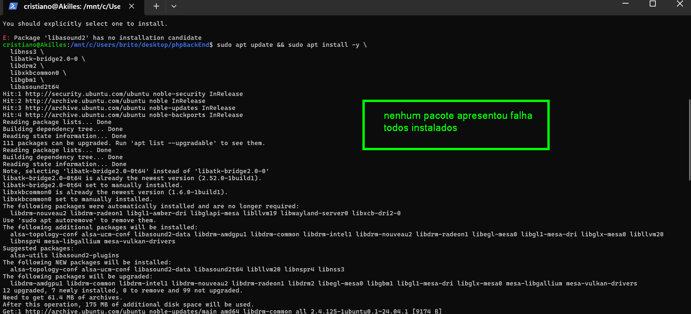

### confirmar se tudo foi instalado
- dpkg -l | grep -E 'libnss3|libatk-bridge|libdrm2|libxkbcommon|libgbm|libasound'

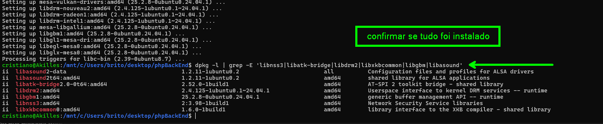

#### importante fechar e abrir o vscode para ver se tudo vai funcionar

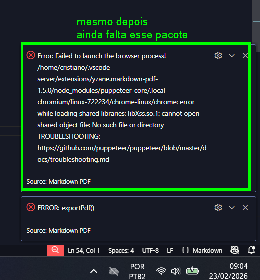

- mesmo depois de instalar tudo ainda falta esse pacote irei instalar manualmente

- sudo apt update
- sudo apt install -y libxss1

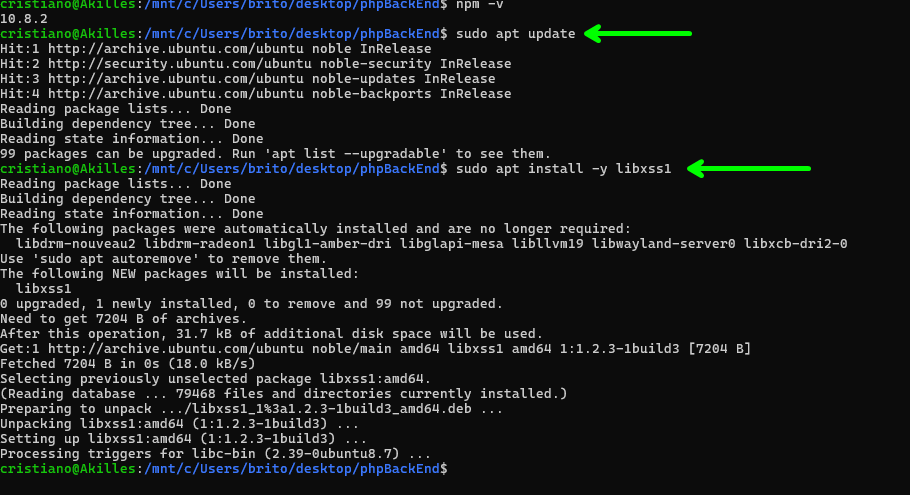

- fechar e abrir o vscode para testar de novo
### erro corrigido estamos salvando mas onde salva?

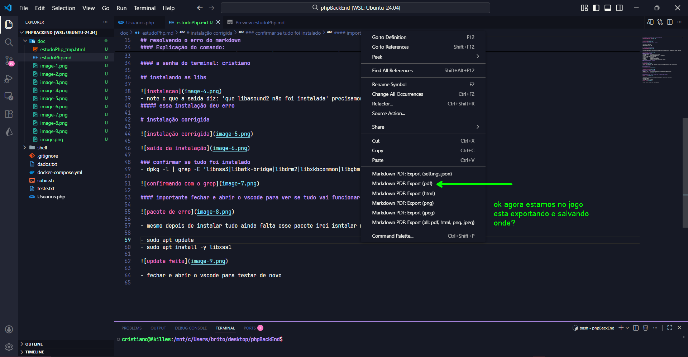

- é salvo no mesmo diretorio

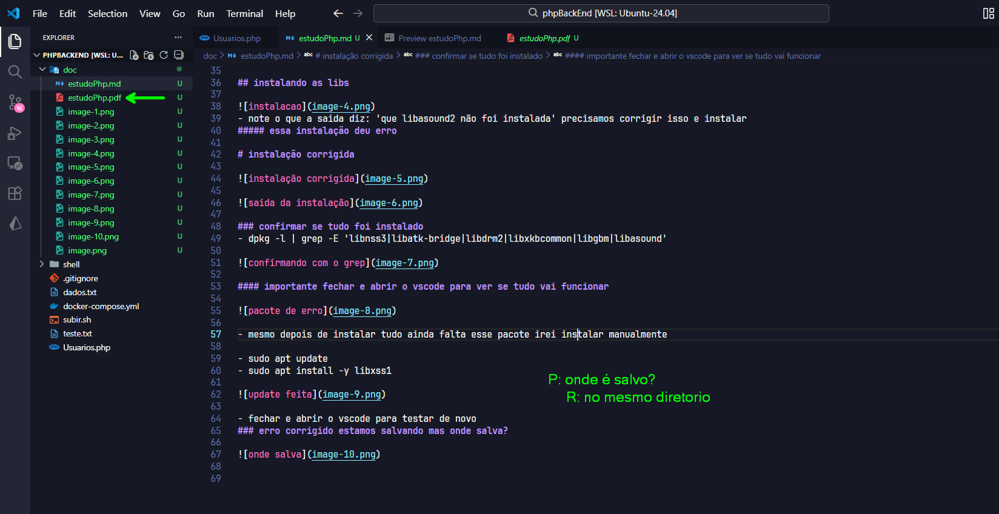

# Estudo de markdown para uso nos pdfs

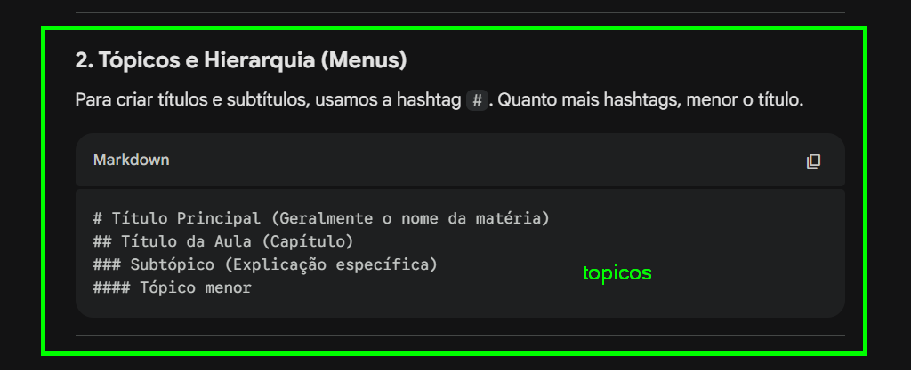

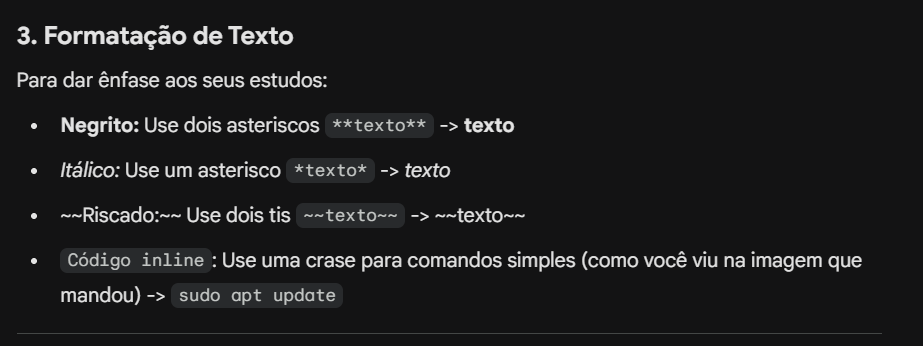

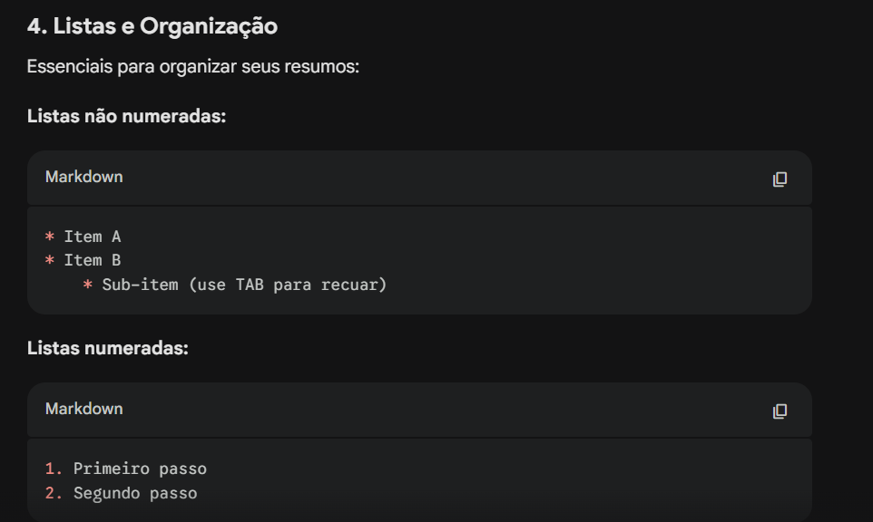

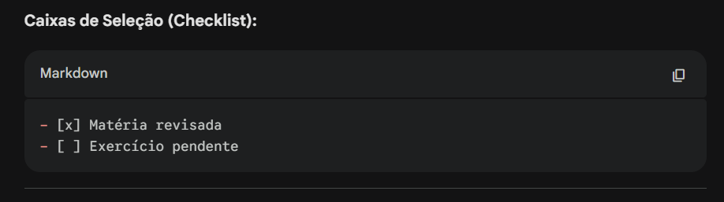

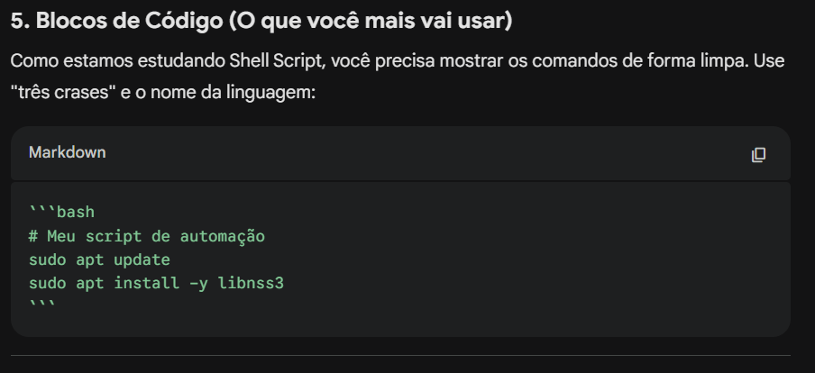

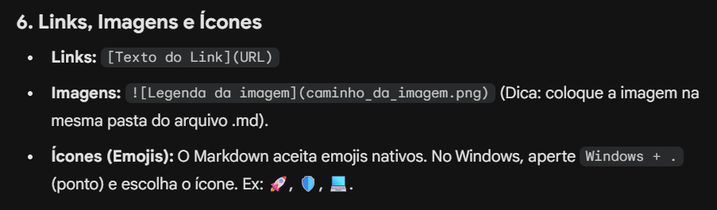

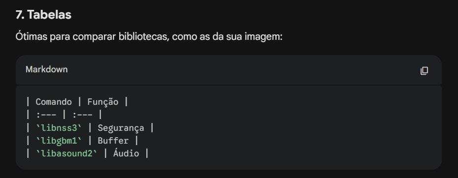

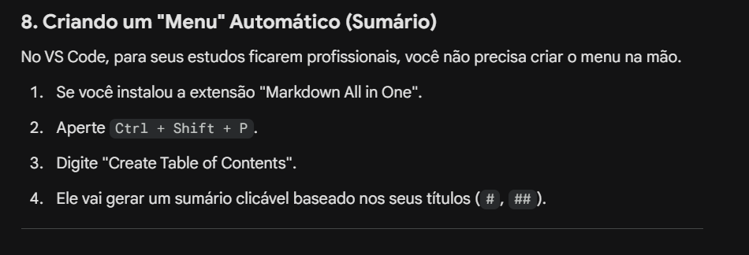

***

# rotulo para cola do gemini

Bom dia! É excelente que você queira usar Markdown no VS Code para seus estudos. Como você já está familiarizado com Shell Script e PHP, vai perceber que o Markdown é a forma mais simples de documentar tudo o que estamos aprendendo.

O Markdown é uma linguagem de marcação leve. Ele não "manda" no design (como o Word), mas sim na estrutura do texto. No VS Code, você verá o código de um lado e o resultado (Preview) do outro.

Aqui está o seu guia completo, do zero ao PDF:

1. Preparando o Terreno (VS Code)
Antes de escrever, precisamos que o VS Code mostre o que você está fazendo:

Crie um arquivo com a extensão .md (exemplo: estudos.md).

No canto superior direito do VS Code, clique no ícone que parece uma folha dividida com uma lupa (Open Preview to the Side).

Dica para PDF: Instale a extensão chamada "Markdown PDF" no VS Code. Ela permitirá que você clique com o botão direito no código e selecione "Markdown PDF: Export (pdf)".

2. Tópicos e Hierarquia (Menus)
Para criar títulos e subtítulos, usamos a hashtag #. Quanto mais hashtags, menor o título.

Markdown
# Título Principal (Geralmente o nome da matéria)
## Título da Aula (Capítulo)
### Subtópico (Explicação específica)
#### Tópico menor
3. Formatação de Texto
Para dar ênfase aos seus estudos:

Negrito: Use dois asteriscos **texto** -> texto

Itálico: Use um asterisco *texto* -> texto

~~Riscado:~~ Use dois tis ~~texto~~ -> ~~texto~~

Código inline: Use uma crase para comandos simples (como você viu na imagem que mandou) -> sudo apt update

4. Listas e Organização
Essenciais para organizar seus resumos:

Listas não numeradas:

Markdown
* Item A
* Item B
    * Sub-item (use TAB para recuar)
Listas numeradas:

Markdown
1. Primeiro passo
2. Segundo passo
Caixas de Seleção (Checklist):

Markdown
- [x] Matéria revisada
- [ ] Exercício pendente
5. Blocos de Código (O que você mais vai usar)
Como estamos estudando Shell Script, você precisa mostrar os comandos de forma limpa. Use "três crases" e o nome da linguagem:

Markdown
​```bash
# Meu script de automação
sudo apt update
sudo apt install -y libnss3
​```
6. Links, Imagens e Ícones
Links: [Texto do Link](URL)

Imagens:  (Dica: coloque a imagem na mesma pasta do arquivo .md).

Ícones (Emojis): O Markdown aceita emojis nativos. No Windows, aperte Windows + . (ponto) e escolha o ícone. Ex: 🚀, 🛡️, 💻.

7. Tabelas
Ótimas para comparar bibliotecas, como as da sua imagem:

Markdown
| Comando | Função |
| :--- | :--- |
| `libnss3` | Segurança |
| `libgbm1` | Buffer |
| `libasound2` | Áudio |
8. Criando um "Menu" Automático (Sumário)
No VS Code, para seus estudos ficarem profissionais, você não precisa criar o menu na mão.

Se você instalou a extensão "Markdown All in One".

Aperte Ctrl + Shift + P.

Digite "Create Table of Contents".

Ele vai gerar um sumário clicável baseado nos seus títulos (#, ##).

Exemplo Prático de como ficaria seu arquivo:
Markdown
--- 
# Estudo de Instalação de Dependências 🛡️

Nesta aula, vimos como preparar o ambiente para o Chromium.

## 1. Comandos Iniciais
É fundamental atualizar o sistema:
* `sudo apt update`: Atualiza as listas.
* `sudo apt install -y`: Instala sem perguntar.

> **Importante:** O parâmetro `-y` economiza tempo em scripts automatizados.

## 2. Tabela de Bibliotecas
| Biblioteca | Utilidade |
| :--- | :--- |
| libnss3 | Segurança |
| libdrm2 | Gráficos |
Próximo Passo:
Gostaria que eu montasse um modelo (template) completo de uma página de estudos sobre o "Módulo de Agendamento e Sinais" que mencionamos no seu plano de aula, já usando todas essas formatações? Seria um ótimo exercício para você testar a exportação para PDF.


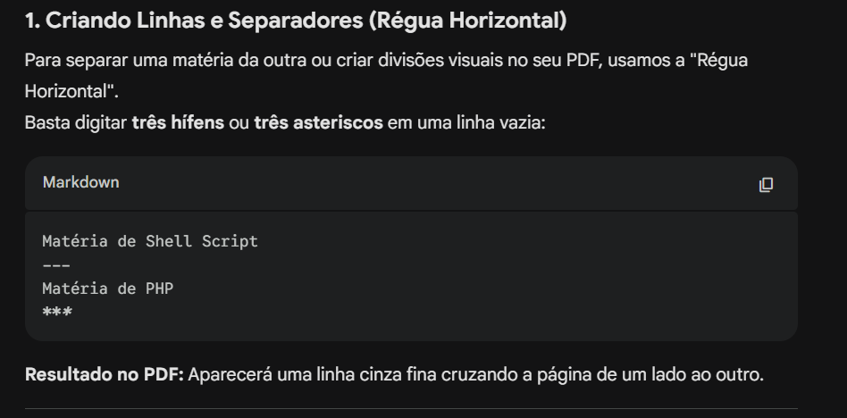

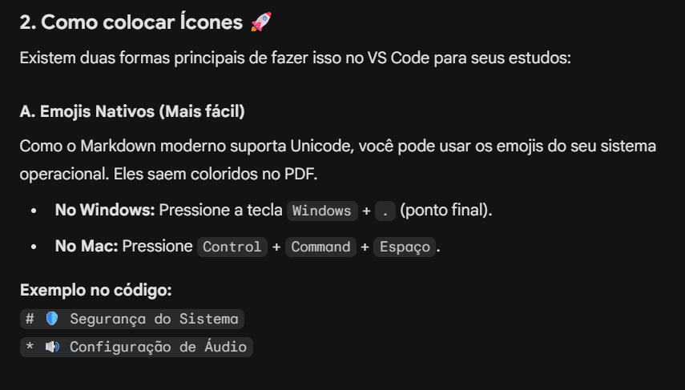

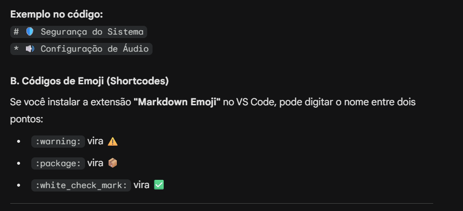

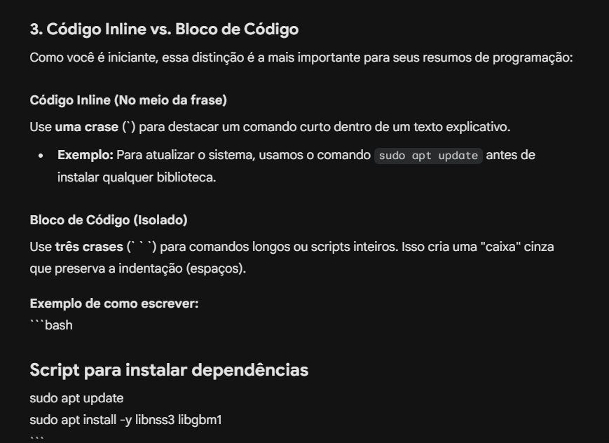

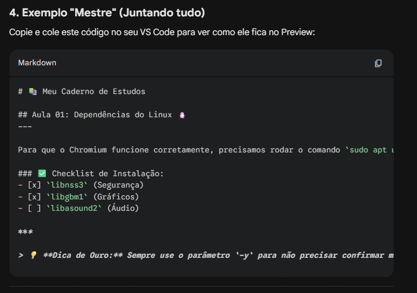

---
# vendo um exemplo como fica

# 📚 Meu Caderno de Estudos

## Aula 01: Dependências do Linux 🐧
---

Para que o Chromium funcione corretamente, precisamos rodar o comando `sudo apt update` para atualizar os repositórios.

### ✅ Checklist de Instalação:
- [x] `libnss3` (Segurança)
- [x] `libgbm1` (Gráficos)
- [ ] `libasound2` (Áudio)

***

> 💡 **Dica de Ouro:** Sempre use o parâmetro `-y` para não precisar confirmar manualmente cada pacote.


***
# citações
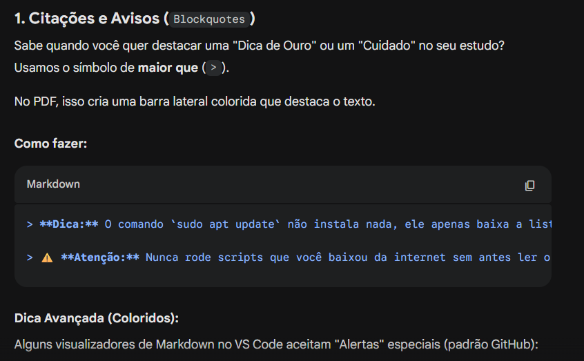

> **Dica:** O comando `sudo apt update` não instala nada, ele apenas baixa a lista de versões novas.

> ⚠️ **Atenção:** Nunca rode scripts que você baixou da internet sem antes ler o conteúdo do arquivo `.sh`.

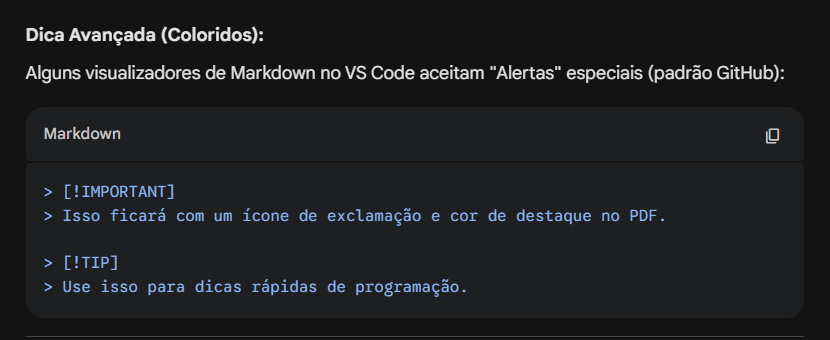

> [!IMPORTANT]
> Isso ficará com um ícone de exclamação e cor de destaque no PDF.

> [!TIP]
> Use isso para dicas rápidas de programação.


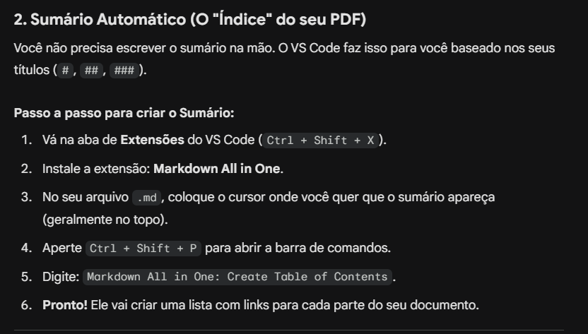

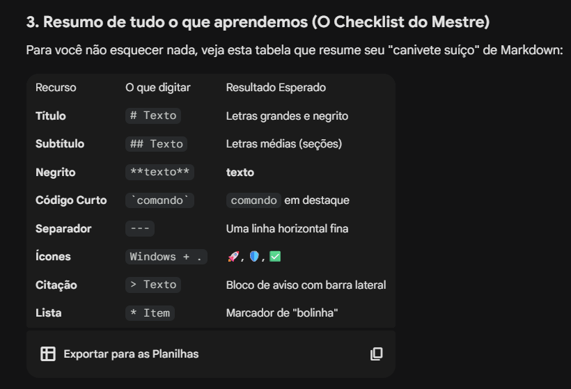

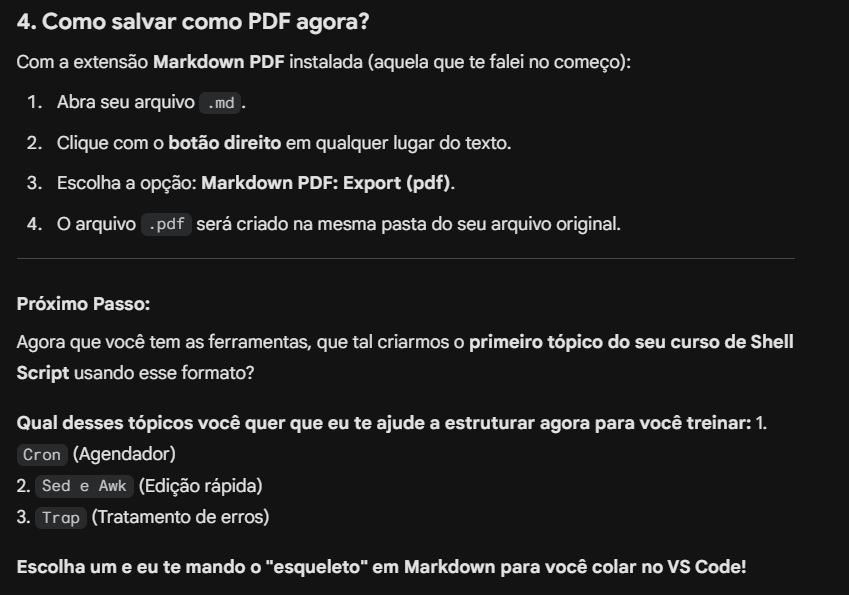

### markdown basico para uso em trabalhos futuros 
- sempre depois de acabar o dia [!IMPORTANT] lembrar de salvar o pdf e salvar no git

- jeito correto de usar o !important
> [!IMPORTANT]
> Sempre depois de acabar o dia, lembrar de salvar o PDF e subir no Git.

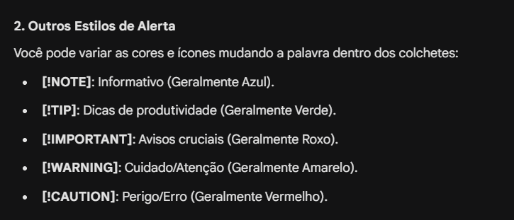

## exemplos:

# ⏰ Módulo: Agendamento com Crontab
---

O `crontab` é o agendador de tarefas do Linux. Ele permite que seu script rode sozinho.

### 🚀 Comandos Principais
* `crontab -e`: Abre o editor para criar agendamentos.
* `crontab -l`: Lista os agendamentos atuais.

> [!IMPORTANT]
> Sempre verifique se o caminho do seu script está completo (ex: `/home/user/script.sh`) dentro do Cron.

***

### 🛠️ Exemplo de Agendamento
Para rodar um script todo dia às 03:00 da manhã:

​```bash
00 03 * * * /caminho/do/seu/script.sh
​```

> [!TIP]
> Use o site `crontab.guru` para validar seus horários se tiver dúvida.

---
# PASSO A PASSO PARA SALVAR SEM USAR A EXTENÇÃO
[!CAUTION]:
> Se a extensão falhar ou você estiver com pressa, existem duas formas "salva-vidas" de transformar seu Markdown em PDF usando ferramentas que você já tem (como o navegador e o LibreOffice).

Aqui está o passo a passo de precaução:

1. Usando o Navegador (O jeito mais rápido)
O VS Code renderiza o Markdown muito bem. Se a extensão de PDF falhar, faça o seguinte:

No VS Code, abra o Preview do seu arquivo (aquele que fica ao lado do código).

Selecione todo o conteúdo do Preview com o mouse (ou Ctrl + A dentro da janela de preview) e copie (Ctrl + C).

Abra o seu Navegador (Chrome, Edge ou Brave).

Pressione Ctrl + V na barra de endereços ou em uma página em branco (ou use um editor online como o StackEdit).

Pressione Ctrl + P (Imprimir) no navegador.

No destino da impressão, escolha "Salvar como PDF".

### essa primeira opção de abrir e salvar no google deu erro

# outra forma de salvar agora com o libreoffice

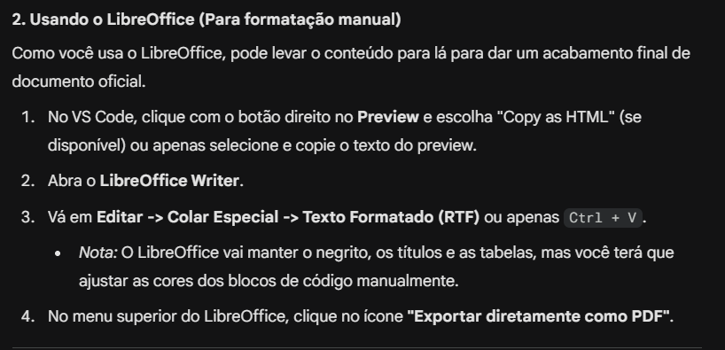

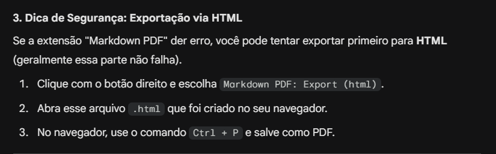

---
# METODO DE SALVAR COMO HTML

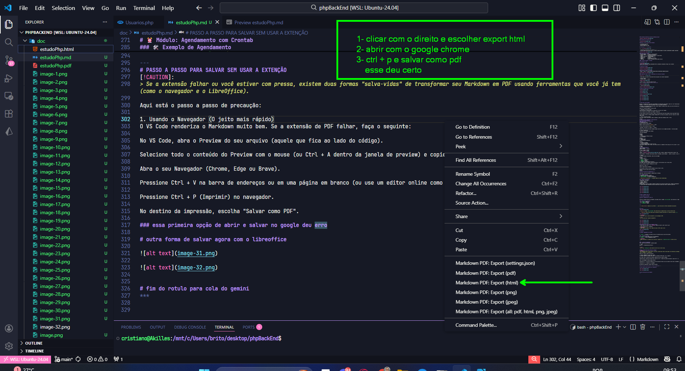

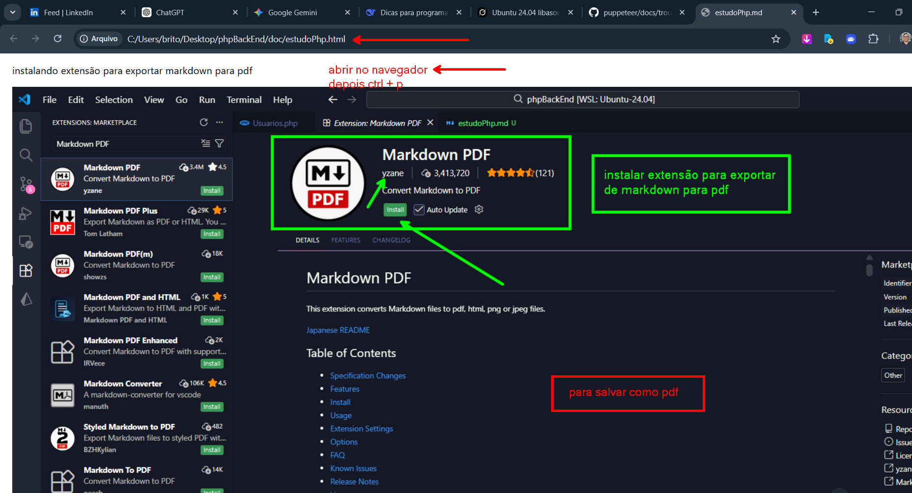

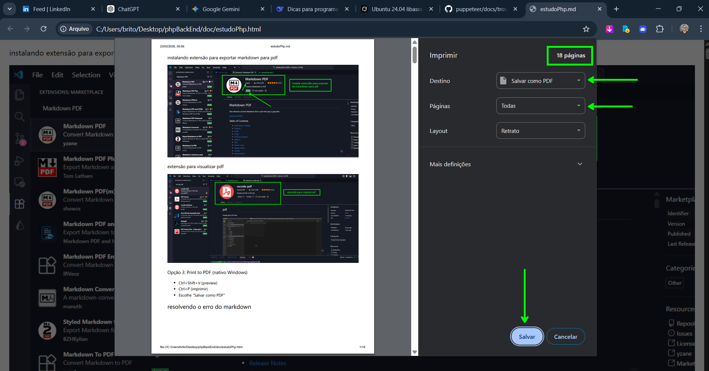

[!CAUTION]:
> essa opção da certo e caso de erro da pra salvar o pdf 
- da pra salvar em formato html e abrir com o google é uma boa opção

# fim do rotulo para cola do gemini
***

# PHP PROCEDURAL

```php
<?php
/**
 * Classe responsável por persistir dados dos usuarios salvos em arquivo de texto.
 * Utilizada para cadastro e listagem simples, ideal para estudos e protótipos sem banco de dados.
 */

class Usuarios 
{
    /** @var string caminho do arquivo onde os nome são armazenados */
    private string $arquivo = 'dados.txt';

    /**
     * salva um novo nome no arquivo
     * Adiciona nome ao final do arquivo
     * @param string $nome o nome do usuario a ser salvo
     * @return void 
     */
    public function salvar(string $nome): void
    {
      file_put_contents($this->arquivo, $nome . PHP_EOL, FILE_APPEND);
    }


    /**
     * Retorna a lista de todos os usuarios cadastrados.
     * Lê o arquivo linha por linha e retorna como array.
     * Cada elemento do array é uma linha do arquivo (inclui possíveis \n se não filtrado).
     * 
     * @return array Lista de nomes (strings) 
     */
    public function listar(): array
    {
        if(! file_exists($this->arquivo))
        {
          echo 'nao encontrado';
          return [];
        }
        
        return file($this->arquivo);

    }
}

?>
```

---
# veja como da certo e fica organizado

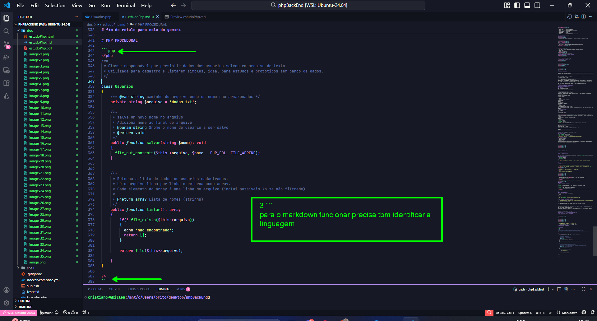

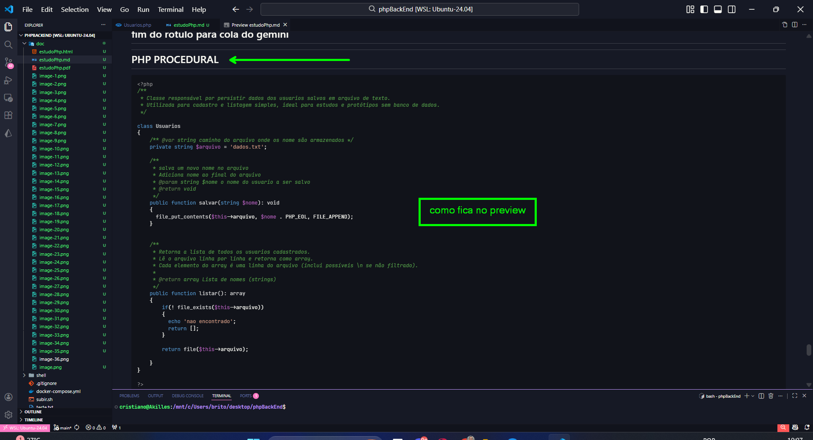

# colcar emojis

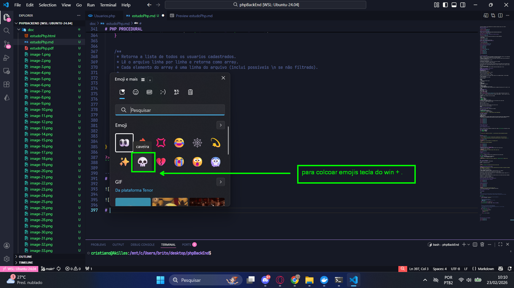

💀 colocado
- [x] lista
- []  item

* itens 1
* itens 2
  * sub iten

---
---


# VAMOS AO PHP QUE INTERESSA
### [2026-02-23 10:20]

✍️ criando uma branch e indo para ela

```bash
cristiano@Akilles:/mnt/c/Users/brito/desktop/phpBackEnd$ git checkout -b feat/read-arq
Switched to a new branch 'feat/read-arq'
cristiano@Akilles:/mnt/c/Users/brito/desktop/phpBackEnd$ 
```
✍️ criando uma branch e indo para ela

​```bash
git checkout -b feat/read-arq
​```
---
> [!TIP]
> O comando `checkout -b` cria a branch e já te joga para dentro dela ao mesmo tempo! 🚀

##### essa de segunda opção esta mais limpa e bonita

```bash
cristiano@Akilles:/mnt/c/Users/brito/desktop/phpBackEnd$ git branch
  2-criar-php-procedural
  develop
* feat/read-arq       <------- [a branch que estou]
  feature/create-objects
  feature/ler-arquivo-de-texto
  feature/setup-backend
  feature/shell-config
  fix
  main
```
```bash
git branch
```
> [!TIP]
> o comando `git branch` mostra as branchs no caso a branch com * é onde estamos 🛖

## DOCKER

```docker
services:
  php:
    container_name: php82
    image: php:8.2-apache
    ports:
      - 8080:80
    volumes:
      - ./:/var/www/html
      - ~/.netrc:/root/.netrc:ro
```
## subindo o containner

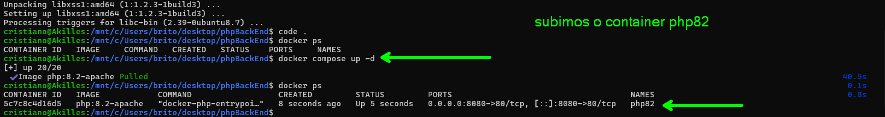

```docker
cristiano@Akilles:/mnt/c/Users/brito/desktop/phpBackEnd$ docker compose up -d
[+] up 20/20
 ✔ Image php:8.2-apache Pulled                                                                                                                                                40.5s
cristiano@Akilles:/mnt/c/Users/brito/desktop/phpBackEnd$ docker ps                                                                                                             0.1s
CONTAINER ID   IMAGE            COMMAND                  CREATED         STATUS         PORTS                                     NAMES                                        0.8s
5c7c8c4d16d5   php:8.2-apache   "docker-php-entrypoi…"   8 seconds ago   Up 5 seconds   0.0.0.0:8080->80/tcp, [::]:8080->80/tcp   php82
cristiano@Akilles:/mnt/c/Users/brito/desktop/phpBackEnd$
```

### arquivo form.php

```html
<!DOCTYPE html>
<html lang="en">
<head>
    <meta charset="UTF-8">
    <meta name="viewport" content="width=device-width, initial-scale=1.0">
    <title>Form entrada de dados</title>
</head>
<body>
    <form action="salvar.php" method="POST">
        <input type="text" name="nome" placeholder="Nome">
        <input type="email" name="email" placeholder="Email">
        <button type="submit">SALVAR</button>
    </form>
</body>
</html>
```

## ERRO NA URL

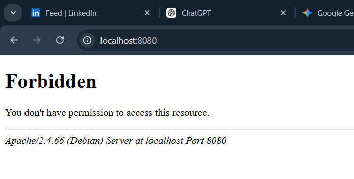

### vamos resolver esse erro
* o que vamos fazer?
  * vamos pesquisar porque esse erro acontece e o que fazer para resolver
* o que pesquisar?
* como e onde pesquisar?

# primeira tentativa dando permissões a pasta
```bash
cristiano@Akilles:/mnt/c/Users/brito/desktop/phpBackEnd$ chmod -x phpBackEnd
chmod: cannot access 'phpBackEnd': No such file or directory
cristiano@Akilles:/mnt/c/Users/brito/desktop/phpBackEnd$ cd ..
cristiano@Akilles:/mnt/c/Users/brito/desktop$ chmod -x phpBackEnd
cristiano@Akilles:/mnt/c/Users/brito/desktop$ ls -la
total 40
drwxrwxrwx 1 cristiano cristiano 4096 Feb 19 09:27  .
drwxrwxrwx 1 cristiano cristiano 4096 Feb 14 07:46  ..
-rwxrwxrwx 1 cristiano cristiano 1232 Aug 31 19:00 'Blender 4.5.lnk'
-rwxrwxrwx 1 cristiano cristiano 1296 Feb 23 08:03 'Clash Royale.lnk'
-rwxrwxrwx 1 cristiano cristiano  949 Sep 16 10:03  CodeBlocks.lnk
-rwxrwxrwx 1 cristiano cristiano  222 Jun 11  2025  Cuphead.url
-rwxrwxrwx 1 cristiano cristiano  222 Jul 25  2025 'Dead Cells.url'
-rwxrwxrwx 1 cristiano cristiano 2247 Feb 19 07:39  Discord.lnk
-rwxrwxrwx 1 cristiano cristiano 2140 Feb 14 09:59 'Docker Desktop.lnk'
-rwxrwxrwx 1 cristiano cristiano  222 Jun 11  2025 'Dying Light.url'
drwxrwxrwx 1 cristiano cristiano 4096 Sep 19 21:38 'Meus projetos'
drwxrwxrwx 1 cristiano cristiano 4096 Sep 27 22:42  NANO
-rwxrwxrwx 1 cristiano cristiano 1413 Nov 30 14:14 'Navegador Opera GX.lnk'
-rwxrwxrwx 1 cristiano cristiano 2189 Feb 12 11:39  Postman.lnk
drwxrwxrwx 1 cristiano cristiano 4096 Jan 26 09:17  Projetos
-rwxrwxrwx 1 cristiano cristiano  222 Jun 11  2025 'Resident Evil 6.url'
-rwxrwxrwx 1 cristiano cristiano 1395 Feb 18 18:03 'Roblox Player.lnk'
-rwxrwxrwx 1 cristiano cristiano 1395 Jul  5  2025 'Roblox Studio.lnk'
drwxrwxrwx 1 cristiano cristiano 4096 Feb 11 08:56  UCLivre
-rwxrwxrwx 1 cristiano cristiano  222 Jun 11  2025  Valheim.url
-rwxrwxrwx 1 cristiano cristiano   69 Jul 21  2025  ballroom@email.com.txt
-rwxrwxrwx 1 cristiano cristiano  282 Mar 25  2025  desktop.ini
drwxrwxrwx 1 cristiano cristiano 4096 Jan 28 10:33  estudo-versao
-rwxrwxrwx 1 cristiano cristiano 2392 Apr 20  2025 'nano - Chrome.lnk'
drwxrwxrwx 1 cristiano cristiano 4096 Feb 20 10:57  nanoBanana
drwxrwxrwx 1 cristiano cristiano 4096 Feb 15 13:24  pddesafio
drwxrwxrwx 1 cristiano cristiano 4096 Jan 28 08:52  php-teste
drwxrwxrwx 1 cristiano cristiano 4096 Feb 23 10:32  phpBackEnd
cristiano@Akilles:/mnt/c/Users/brito/desktop$ cd php
php-teste/  phpBackEnd/
cristiano@Akilles:/mnt/c/Users/brito/desktop$ cd phpBackEnd/
cristiano@Akilles:/mnt/c/Users/brito/desktop/phpBackEnd$ ls -la
total 4
drwxrwxrwx 1 cristiano cristiano 4096 Feb 23 10:32 .
drwxrwxrwx 1 cristiano cristiano 4096 Feb 19 09:27 ..
drwxrwxrwx 1 cristiano cristiano 4096 Feb 23 10:17 .git
-rwxrwxrwx 1 cristiano cristiano   37 Feb  1 09:25 .gitignore
drwxrwxrwx 1 cristiano cristiano 4096 Feb 23 10:41 doc
-rwxrwxrwx 1 cristiano cristiano  173 Feb  9 10:48 docker-compose.yml
-rwxrwxrwx 1 cristiano cristiano  437 Feb 23 10:34 form.php
drwxrwxrwx 1 cristiano cristiano 4096 Feb  1 10:50 shell
-rwxrwxrwx 1 cristiano cristiano  989 Feb  9 10:48 subir.sh
cristiano@Akilles:/mnt/c/Users/brito/desktop/phpBackEnd$
```

### mesmo depois de dar permissão o erro continuou 
- vou pesquisar no google para saber como resolver.
* Porque o erro acontece?
  * Geralmente causado por permissões incorretas do sistema de arquivos ou problemas de configuração do servidor Apache.
* Possiveis soluções
    * entrar no container e verificar as permissões
```bash
PS C:\Users\brito> docker exec -it php82 bash
root@5dcd60f46f04:/var/www/html# pwd
/var/www/html
root@5dcd60f46f04:/var/www/html# ls -l
total 4
drwxrwxrwx 1 1000 1000 4096 Feb 23 13:41 doc
-rwxrwxrwx 1 1000 1000  173 Feb  9 13:48 docker-compose.yml
-rwxrwxrwx 1 1000 1000  437 Feb 23 13:34 form.php
drwxrwxrwx 1 1000 1000 4096 Feb  1 13:50 shell
-rwxrwxrwx 1 1000 1000  989 Feb  9 13:48 subir.sh
root@5dcd60f46f04:/var/www/html#
```
- entrar no container e verificar o arquivo de configuração geralmente em:
  * /etc/apache2/apache2.conf

- verificar se existe essa trava
```bash
root@5dcd60f46f04:/var/www/html# grep -r "Require all denied" /etc/apache2/
/etc/apache2/mods-available/proxy.conf:#   Require all denied
/etc/apache2/apache2.conf:      Require all denied
/etc/apache2/apache2.conf:      Require all denied
root@5dcd60f46f04:/var/www/html#
```
# como resolver 
- instalar o nano
    * apt update && apt install nano -y
- abrir o arquivo
    * nano /etc/apache2/apache2.conf
- instalei o vim dentro do container
    * root@5dcd60f46f04:/var/www/html# apt update && apt install vim -y

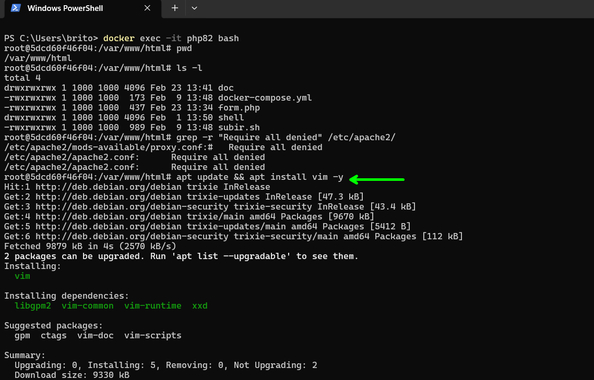

- abrindo o arquivo com o vim
    * root@5dcd60f46f04:/var/www/html# vim /etc/apache2/apache2.conf

```bash
root@5dcd60f46f04:/var/www/html# vim /etc/apache2/apache2.conf
```

- tecle (i) depois de entrar no vim

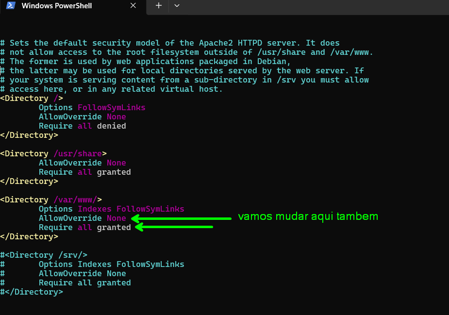

- vamos modificar salvar e sair
> [!CAUTION]
> `esc: wq` para salvar e sair

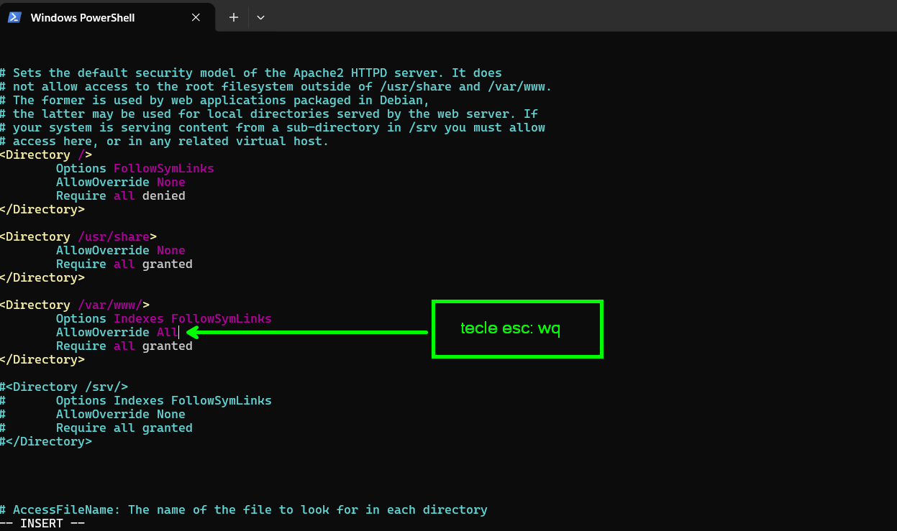

- agora reiniciamos o apache
    * service apache2 restart

```bash
root@5dcd60f46f04:/var/www/html# vim /etc/apache2/apache2.conf
root@5dcd60f46f04:/var/www/html# service apache2 restart
Restarting Apache httpd web server: apache2Terminated
```
- docker
    * docker compose down
    * docker compose up -d
- mesmo depois disso o erro continua

## outra tentativa
- coloquei um index.php dentro da raiz 

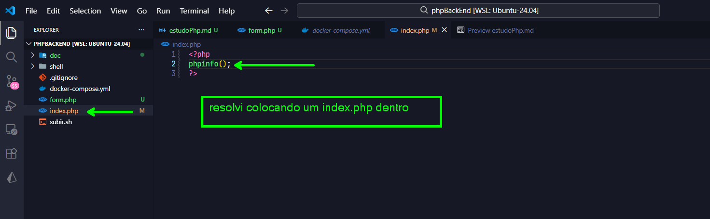

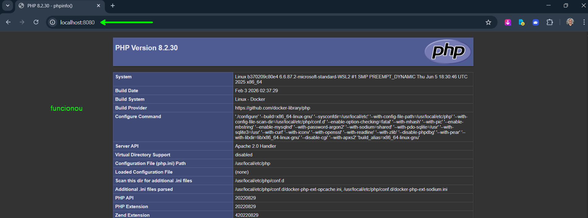

- url para acessar o form
    * http://localhost:8080/form.php 

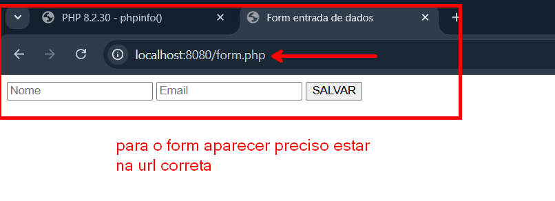

*** quando ele mostra o index.php significa que ele esta configurado e rodando corretamente ***

# erros que cometi ao escrever o code

1. file_put_contents($arquivo, $nome . PHP_EOL, FILE_APPEND);
    - esqueci `FILE_APPEND` ele adiciona novos dados ao final de um arquivo existente. se o arquivo não existir ele será criado
    - sem o `FILE_APPEND` é sempre sobreescrito

## CODES CORRETOS

- salvar.php

```php
<?php
$nome = $_POST['nome'] ?? '';

echo '<pre>';
print_r($nome);
echo '</pre>';

if('nome' === 0){
  echo "nome obrigatorio";
  exit;
}

$arquivo = 'dados.txt';

file_put_contents($arquivo, $nome . PHP_EOL, FILE_APPEND);

header('Location: listar.php');

?>

```

---
- listar.php
```php
<?php
$arquivo = "dados.txt";

if(!file_exists($arquivo)){
  echo "arquivo nao existe";
  exit;
}

$lines = file($arquivo);

foreach($lines as $line){
   echo htmlspecialchars($line) . '<br>';
}

?>

```

### por hoje é só [2026-02-23 11:52]✌️
- salvar tudo no git e chau chau👋